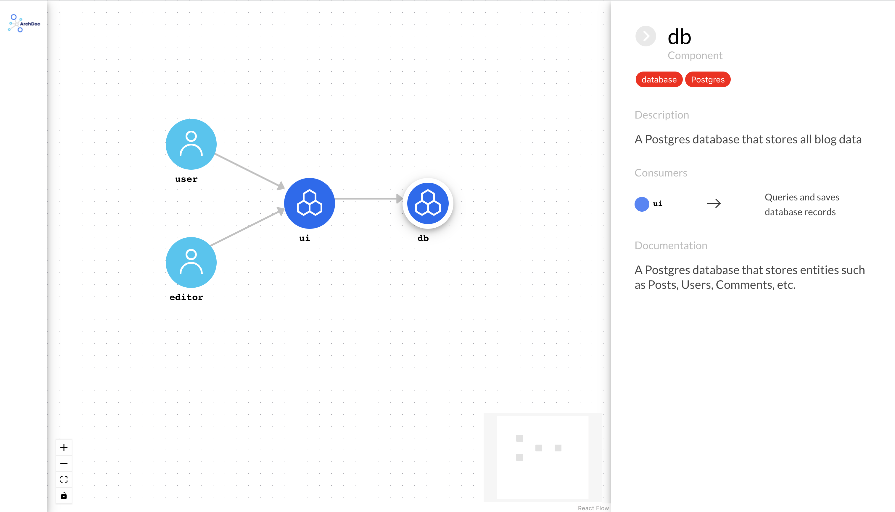

# Getting Started

This guide will walk you through the steps to get started with ArchDoc UI, a tool for generating documentation for your software architecture. Follow the instructions below to install and run ArchDoc UI.

## Prerequisites

To get started with ArchDoc UI, make sure you have Node.js v14 or higher installed on your machine.

## Installation

To install ArchDoc UI, run the following command in your terminal:

```bash
$ npm i -g @archdoc/archdoc-ui
```

## Creating an ArchDoc Specification file

Once ArchDoc UI is installed, create an ArchDoc Specification file that describes your software architecture. The example below shows a YAML file that describes a blogging application.

```yaml
archdoc: 1.0.0

users:
  user:
    description: "An unauthenticated user."
    dependencies:
      ui: "Reads blog posts and articles"
    documentation: "An unauthenticated user that reads articles."
  editor:
    description: "The admin user of the blog."
    dependencies:
      ui: "Posts blog articles"
    documentation: "The admin user that posts articles."

components:
  ui:
    description: "The frontend application that serves the application users"
    repository: "https://github.com/example/myblogui"
    tags:
      - "frontend"
      - "Next.js"
    dependencies:
      db: "Queries and saves database records"
    documentation: "A frontend application written in Next.js that serves all users to the blog."
  
  db:
    description: "A Postgres database that stores all blog data"
    tags:
      - "database"
      - "Postgres"
    documentation: "A Postgres database that stores entities such as Posts, Users, Comments, etc."
```

For more details on creating these files, please see the [ArchDoc Specification](../specification/).

## Running ArchDoc UI

To visualize your software architecture, run the following command in your terminal, replacing example.yaml with the path to your ArchDoc Specification file:

```bash
$ archdoc example.yaml
     _             _     ____
    / \   _ __ ___| |__ |  _ \  ___   ___
   / _ \ | '__/ __| '_ \| | | |/ _ \ / __|
  / ___ \| | | (__| | | | |_| | (_) | (__
 /_/   \_\_|  \___|_| |_|____/ \___/ \___|

Configuring server...

Serving ArchDoc viewer on http://localhost:7123...
```

ArchDoc UI should now open up a new browser window and display your ArchDoc model:



That's it! Now you are ready to define and model your organization's architecture! 🚀
